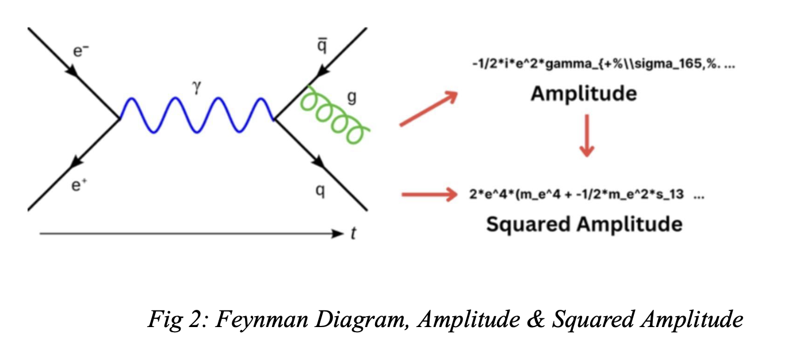
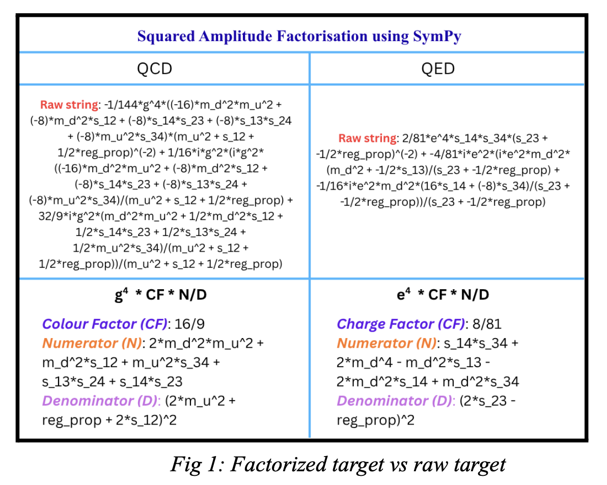

# Common Task 1.2: Dataset Preprocessing

This part focuses on preparing the symbolic dataset so the later models have a cleaner and more learnable representation.

Large generated artifacts are not bundled in this repository copy. Related exported outputs are available on Google Drive:

- [SYMBA evaluation outputs](https://drive.google.com/drive/folders/1BUmaO2sva8YHfezcYzSHoBdY3oQPRGaa?usp=share_link)

## What Happens Here

- each SYMBA line is split into interaction text, topology text, raw amplitude, and raw squared amplitude
- raw amplitudes are tokenised with bounded local placeholders such as `%gam_5702 -> %gam_INDEX_1` and `p_3 -> MOMENTUM_0`
- raw squared amplitudes are compared against factorized targets so the prefactor / numerator / denominator structure is explicit

## Visual Overview

## A Few Useful Numbers

- dataset size: QCD `234`, QED `360`
- raw amplitude vocab: QCD `6892`, QED `3449`
- bounded amplitude vocab: QCD `694`, QED `198`
- raw squared postfix vocab: QCD `84`, QED `39`
- factorized postfix vocab: QCD `29`, QED `32`
- average bounded source length: QCD `429.72`, QED `120.87`
- average raw squared postfix length: QCD `326.49`, QED `69.52`
- average factorized postfix length: QCD `46.64`, QED `42.70`

## Main File

- [tokenization-eda-2.ipynb](tokenization-eda-2.ipynb)

## Thank you!
Please mail me at sreenandan.shashidharan@gmail.com or at 24JE0701@iitism.ac.in if anything is amiss. I sincerely apologise in advance. 
