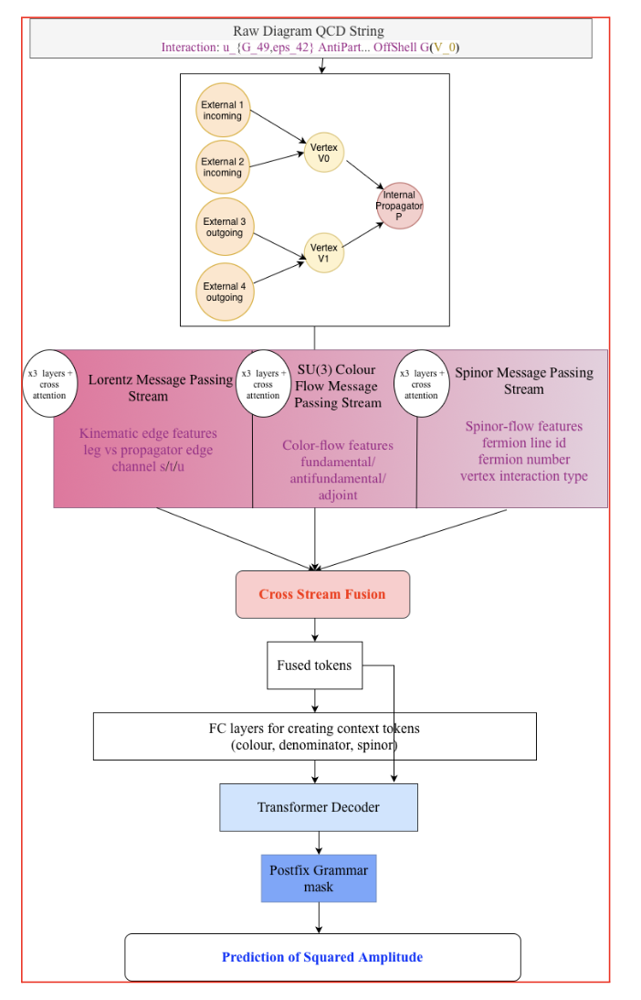
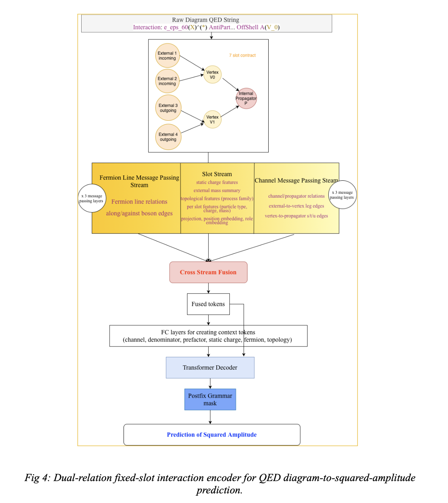
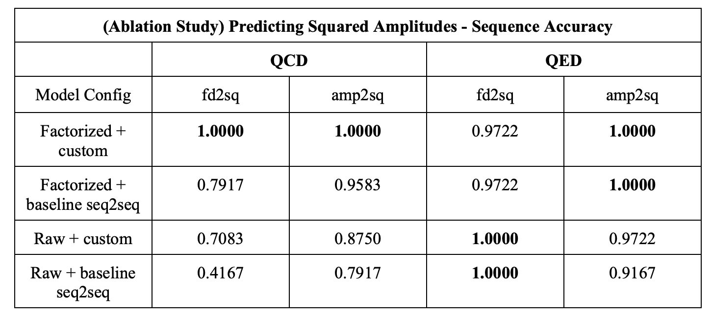
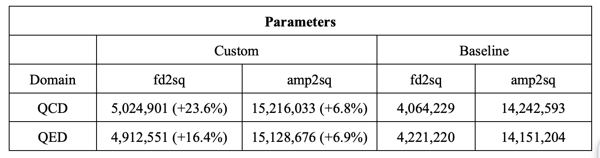
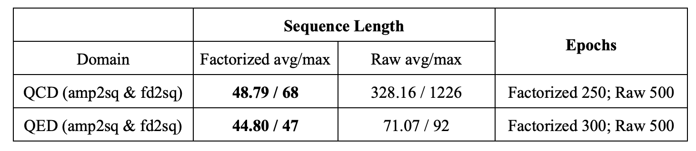

# Specific Task 2.1: Train / Evaluate Advanced Model

This part focuses on training and evaluating advanced models on top of the representations prepared in Common Task 1.2.

The generated `outputs/` directory is too large. Experiment outputs, summaries, and other large artifacts are available on Google Drive:

- [SYMBA evaluation outputs](https://drive.google.com/drive/folders/1BUmaO2sva8YHfezcYzSHoBdY3oQPRGaa?usp=share_link)

## The Four Main Models

- `custom_qcd_fd2sq`: three-stream graph encoder for QCD diagrams
- `custom_qed_fd2sq`: fixed-slot dual-relation encoder for QED diagrams
- `custom_qcd_amp2sq`: physics-tagged sequence encoder for QCD amplitudes
- `custom_qed_amp2sq`: physics-tagged sequence encoder for QED amplitudes

  The 4 notebooks (.ipynb) files can be run end to end after changing the dataset path. The notebooks include observations, training logs and metrics. 

All four models share the same target-side setup. I train them against either the raw squared-amplitude string or a factorized symbolic target, and the decoder generates postfix sequences under grammar constraints. This keeps the decoder stack comparable while letting the encoder design carry most of the physics-specific inductive bias.

## Architecture Snapshots

### QCD Diagram -> Squared Amplitude

The QCD diagram model is a three-stream symmetry-aware equivariant GNN. Each tree-level `2 -> 2` diagram is represented as a 7-node graph with `4` external particles, `2` vertices, and `1` propagator. On that graph, the encoder runs:

- a Lorentz / kinematic stream for momentum signatures, masses, and channel labels
- an SU(3) color-flow stream for fundamental, anti-fundamental, and adjoint color structure
- a spinor / fermion-line stream for fermion routing and interaction type

After each message-passing layer, the streams exchange information through cross-stream exchange, and the final graph states are fused into a shared memory used by the decoder. The model also builds global context tokens that summarize color, denominator, and spinor information.

### QED Diagram -> Squared Amplitude

The QED diagram model uses a dual-relation fixed-slot interaction encoder. Instead of a generic graph, it relies on a canonical 7-slot contract with `4` external slots, `2` vertex slots, and `1` propagator slot. Each slot stores features such as particle type, flavor, charge, mass, and incoming/outgoing role. Message passing happens over two relation systems:

- channel / propagator relations for the scattering channel structure
- fermion-line relations for directed fermion flow

The fused slot states are combined with compact topology- and charge-aware context tokens before decoding.

### Amplitude -> Squared Amplitude

The amplitude models use a physics-tagged structured sequence encoder. Each amplitude is first canonicalized with bounded normalization of indexed symbols and momenta. The source is then rewritten as one enriched sequence with three tagged sections:

- `[RAW_SRC]` for the bounded raw amplitude
- `[GLOBAL]` for coupling powers, rational prefactors, denominator tokens, and theory-level metadata
- `[TERM_SUMMARIES]` for per-term physics summaries such as coefficient pattern, atom counts, flavor counts, and chain lengths

A Transformer encoder reads this full tagged sequence, and pooled views of the different sections are turned into condition tokens that are prepended to decoder memory. This gives the decoder both local symbolic detail and higher-level physics summaries.

## Experiment Summary

### Sequence Accuracy

### Parameter Comparison

### Sequence Length and Epochs

## Detailed Output Notes

The summarized notes live in the top-level `outputs/` folder in the full project workspace. In this shared repository copy, those large output artifacts are provided through the Google Drive folder above.

Note: in the saved QCD `amp2sq` notebook outputs and summary files, the current `custom` encoder still appears under the older legacy label `gnn` / `pi_gnn_amp2sq`; this is a naming carry-over, not a different architecture.

## Thank you!
Please mail me at sreenandan.shashidharan@gmail.com or at 24JE0701@iitism.ac.in if anything is amiss. I sincerely apologise in advance. 
