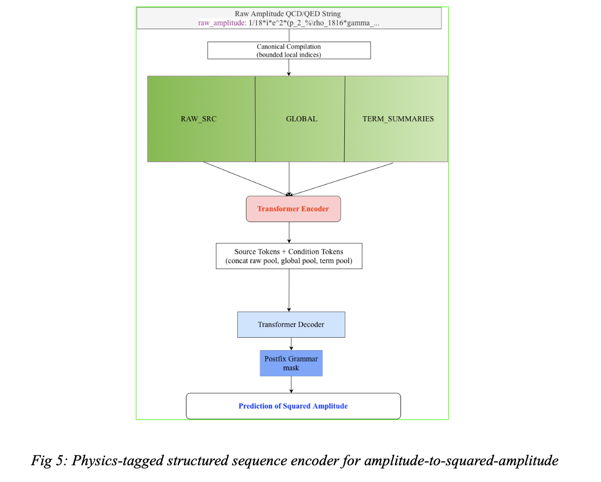

# QCD Amplitude -> Squared Amplitude

Physics-tagged structured sequence encoder for predicting squared amplitudes from QCD tree-level 2->2 amplitudes.

## Architecture Snapshot



## Architecture

The encoder compiles each raw amplitude string into a canonical form with bounded indices and momenta, then constructs a single flat source sequence with three tagged sections:

- **`[RAW_SRC]`** — bounded raw amplitude tokens
- **`[GLOBAL]`** — global metadata: i-power, g-power, rational prefactor, denominator tokens
- **`[TERM_SUMMARIES]`** — per-term physics features: coefficient sign/magnitude, scalar factors, atom counts, flavor counts, Dirac/Lorentz chain lengths, momentum slots

A Transformer encoder processes the full tagged sequence. Section-specific pools (raw, global, term-feature, whole-sequence) are fused into four condition tokens (raw context, feature context, family-style context, global condition) prepended to the encoded source memory. The decoder is an autoregressive Transformer over postfix symbolic sequences with `RPNGrammar` constraints.

## Results

| Target | Encoder | Test Seq Accuracy |
| --- | --- | ---: |
| factorized | custom | **1.0000** |
| factorized | seq2seq | 0.9583 |
| raw_string | custom | 0.8750 |
| raw_string | seq2seq | 0.7917 |

234 QCD amplitudes, 80/10/10 split, seed 42.

## Package Structure

| File | Role |
| --- | --- |
| `compiler.py` | Raw amplitude -> canonical compiled form |
| `interaction.py` | Amplitude record and interaction metadata |
| `contracts.py` | Constants and term-summary contracts |
| `parser.py` | SYMBA text -> amplitude/squared-amplitude pairs |
| `sequence_utils.py` | Source sequence construction (`[RAW_SRC]`, `[GLOBAL]`, `[TERM_SUMMARIES]`) |
| `encoder.py` | Physics-tagged sequence encoder + flat seq2seq baseline |
| `factorization.py` | Factorized target construction |
| `tokenizer.py` | Symbolic tokenization (literal-preserving) |
| `grammar.py` | Postfix RPN grammar masks |
| `model.py` | Full encoder-decoder model with pooled condition tokens |
| `dataset.py` | Dataset, corpus loading, collation |
| `splits.py` | Train/val/test split logic |
| `train.py` | Training loop |
| `config.py` | Dataclass configuration |
| `run.py` | CLI entrypoint |

## Usage

```bash
# Smoke test
PYTHONPATH="Specific Task 2.1" python -m custom_qcd_amp2sq.run --smoke-test --data-dir dataset --encoder-variant custom

# Full training
PYTHONPATH="Specific Task 2.1" python -m custom_qcd_amp2sq.run --data-dir dataset --output-dir outputs/custom_qcd_amp2sq --encoder-variant custom --target-variant factorized
```

## Planned Directions

Amplitude -> squared amplitude is the most open part of the project and will receive significant focus during GSoC. Planned approaches include: tensor-contraction graph encoding over gamma/spinor/propagator networks, contrastive pre-training over amplitudes that share the same squared amplitude, and a hybrid diagram+amplitude joint encoder that fuses the fd2sq graph encoder with the amp2sq sequence encoder.

## Previous Approaches Tried

1. **Pure seq2seq over raw amplitude tokens** — treats the amplitude as a flat string; ignores internal structure. Kept as baseline.
2. **Graph-first encoder for amplitudes** — tried treating amplitudes primarily as graphs; did not capture symbolic and interference structure well enough.
3. **Heavier family-signature and graph-derived side channels** — added richer canonical summaries; became too long or indirect.
4. **Physics-tagged structured sequence encoder** (current) — augments bounded raw tokens with `[GLOBAL]` and `[TERM_SUMMARIES]` sections, pooled into condition tokens. Best result: 100% test accuracy on factorized target.
